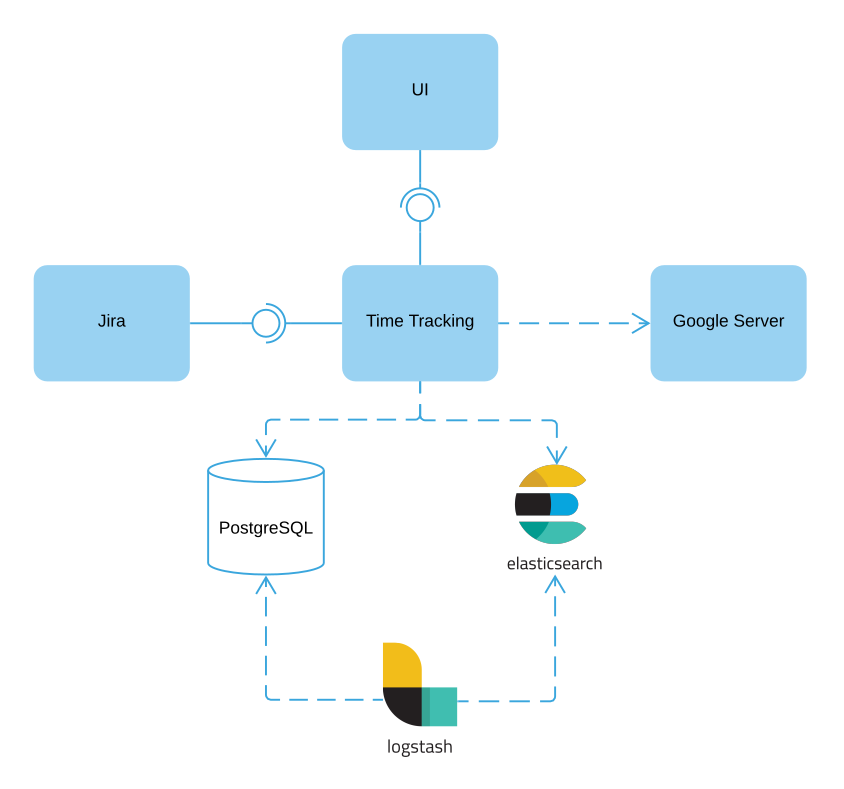

# TimeTracking
Time tracking and project management backend system made with Spring Boot, Elasticsearch, Postgres, Logstash, Docker. It is integrated with Jira. React application in this project serves as a concept demonstrating the login process with Google OAuth 2.0. The JSON Web Token (JWT) is used to pass identity of authenticated users between backen REST API and client.

# TimeTracking server side application modules

